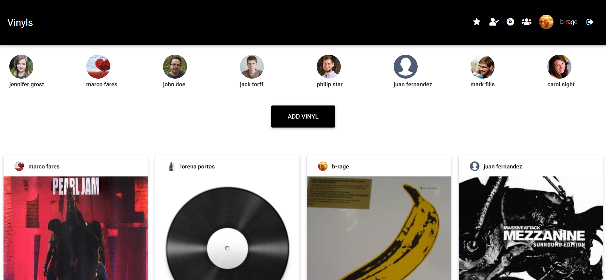
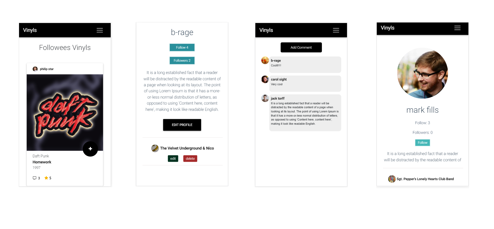

# Vinyls

Vinyls is social networking service. You can publish your collection of vinyls and sharing with other users. 

It will be developed for the presentation of the final project of the bootcamp in [Skylab Coders](https://skylabcoders.com/).


View the [Documentation](./docs/README.md)

## Screenshoot






## Instructions

### Running the application

__Server__

```
$ cd vinyls-api
$ npm i
$ npm run build
$ npm start
```

__Frontend__

```
$ cd vinyls-app
$ npm i
$ npm run build
$ npm start
```
Live demo [http://warm-boy.surge.sh/](http://warm-boy.surge.sh/#/)

## Authors

- Gianluca Bragaglia [https://github.com/b-rage](https://github.com/b-rage)

