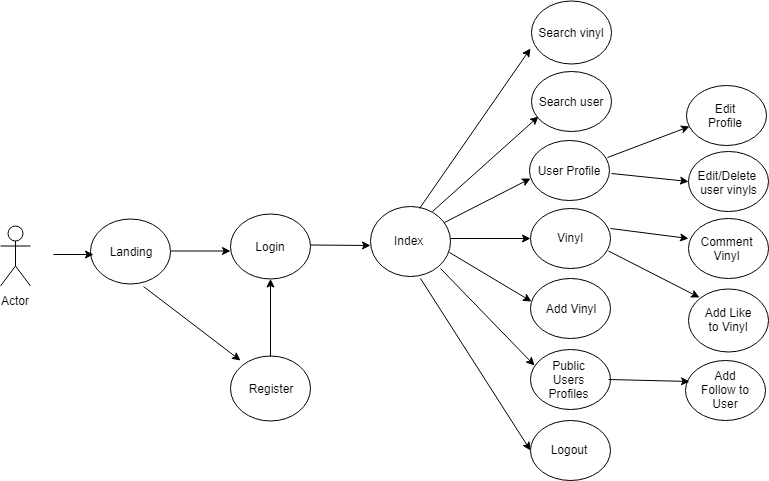
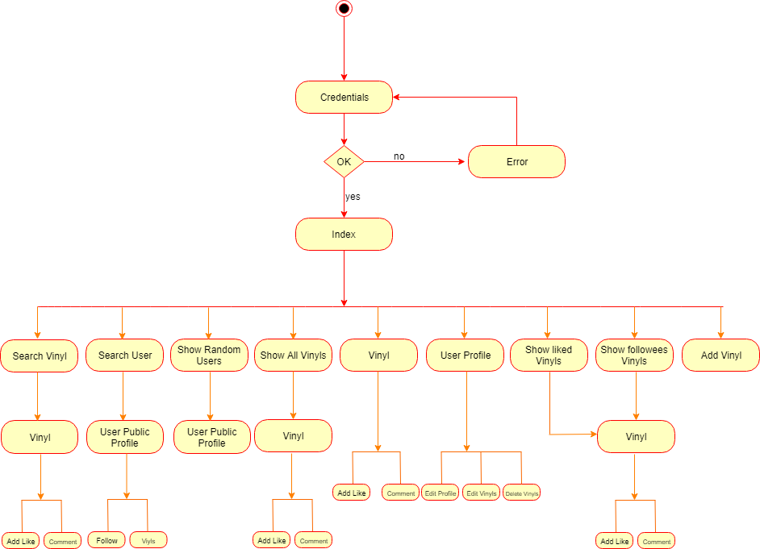
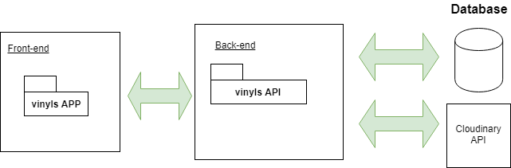
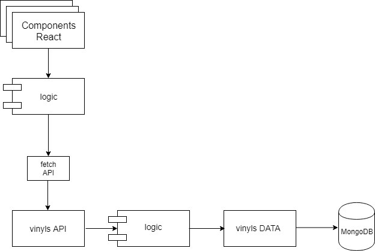
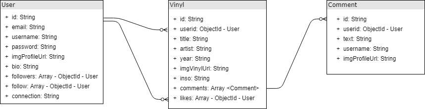

# Vinyls

## Introduction

The application allows to register users. The user can upload their vinyls, follow other users, likes vinyls, add comment to vinyls.

You can also search for users and search for vinyls

Each user has a profile page where can see his data and the related vinyls.

The user can has a section where they can edit his personal data, profile photo, edit or delete his vinyls.

## FUNCTIONAL DESCRIPTION

## Use cases diagram

## Activity Diagram

The application has one main activity: publish your vinyls, and other cativities like a search users, search vinyls, follow users, likes vinyls, comment vinyls.

## TECHNICAL DESCRIPTION

## Block diagram
The front end of the application was built using React. The back end is connected to an API that is connected to data module DATA to update the Database(CRUD)

## Components Diagram
The application has some react components, the front-end logic, the API back-end, the Api logic connected to the data that interacts with the mongoDB Database.

## Data model

The Application has 3 data models, User, Vinyl and Comment that is embedded in Vinyl.

## Technology Stack

* HTML
* CSS
* Javascript (ES6)
* React
* React Router
* MD Bootstrap React
* APIs
* Node js
* Express
* Mongoose
* MongoDB
* TDD Mocha - Chai

